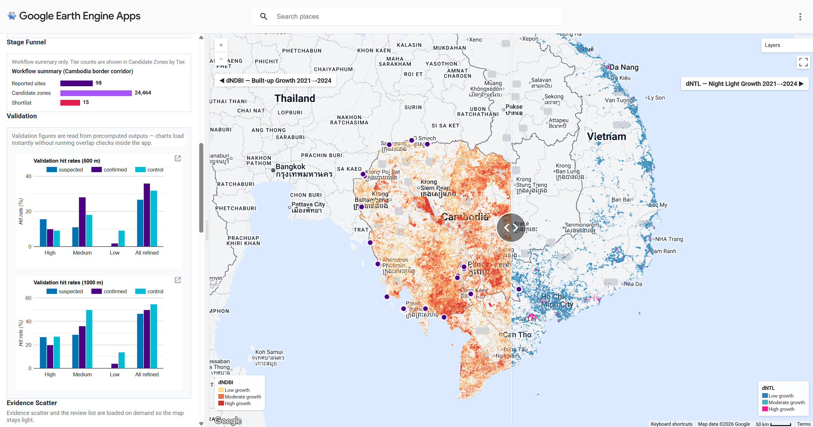

## Project Summary

This project developed a Google Earth Engine-based application to analyze suspected fraud compounds in Southeast Asia.  Referencing Amnesty International and ASPI (2025) data, the model integrates satellite embedding similarity, Sentinel-2 change indicators, nighttime lights, and spatial variables.  The analysis included 53 confirmed, 45 suspected, and 22 control sites in the study area to build a reproducible screening workflow by identifying points and to evaluate model performance through suspected locations and control points. This interactive platform enables researchers, journalists, and observers to explore development patterns, assisting governments in monitoring border security and combating organized crime through an interpretable, data-driven framework.

::: {style="text-align: center;"}
{width=100%}

<p style="font-size: 0.9em; margin-top: 0.5em;">Resource From: United Nations Office on Drugs and Crime (2023, 2025), Global Initiative (2026)</p>
:::

---

### Problem Statement

Transnational cyber scams in Southeast Asia present a major humanitarian crisis (UNODC, 2025). Criminal gangs are strategically located in border areas and spatially overlap with legitimate commerce (ASPI, 2025), alongside fragmented reporting (Global Initiative, 2026). Our application bridges the gap between remote sensing technology and policy-oriented surveys by providing a reproducible, satellite-based screening tool. By grounding analysis in documented reference cases, the platform offers an intuitive interface to visualize high-risk zones, helping researchers and policymakers overcome data-sharing barriers and enhance regional security planning.

### End User

Our platform is designed for human rights monitoring agencies, investigative journalists,
and policy-oriented researchers working to combat transnational crime in Southeast Asia.
Limited public information and complex on-the-ground situations have long hampered the
effectiveness of international interventions. Our interactive map is designed to improves 
access to spatial screening outputs, and provides a structured evidence base for further 
investigation into forced labour, human trafficking, and related forms of abuse.

---

### Data


| Category | Dataset | Description | Source |
|----------|---------|-------------|--------|
| Satellite Embedding | Google Satellite Embedding V1 Annual | 64-dimensional annual embedding vectors at 10 m resolution, used for Stage 1 similarity search | [GEE Catalog](https://developers.google.com/earth-engine/datasets/catalog/GOOGLE_SATELLITE_EMBEDDING_V1_ANNUAL) |
| Satellite Imagery | Sentinel-2 SR Harmonised | Multispectral imagery for NDBI, NDVI and visual basemap (2021–2024) | [GEE Catalog](https://developers.google.com/earth-engine/datasets/catalog/COPERNICUS_S2_SR_HARMONIZED) |
| Night-time Lights | VIIRS DNB Monthly V1 VCMCFG | Night-time radiance for activity growth detection (dNTL 2021–2024) | [GEE Catalog](https://developers.google.com/earth-engine/datasets/catalog/NOAA_VIIRS_DNB_MONTHLY_V1_VCMCFG) |
| Boundaries | USDOS LSIB Simple 2017 | Country boundary geometries for AOI definition | [GEE Catalog](https://developers.google.com/earth-engine/datasets/catalog/USDOS_LSIB_SIMPLE_2017) |
| Boundaries | FAO GAUL 2015 | Province-level administrative boundaries | [GEE Catalog](https://developers.google.com/earth-engine/datasets/catalog/FAO_GAUL_2015_level1) |
| Reference Sites | Confirmed Scam Locations | 53 confirmed sites from Amnesty International and ASPI | [Amnesty International](https://www.amnesty.org) |
| Reference Sites | Suspected and Control Points | 45 suspected sites and 22 control points for validation | [ASPI](https://www.aspi.org.au) |

Based on precise location data from Amnesty International (2025) and ASPI (2025), our final compiled dataset includes confirmed points, suspected points, and control points on GitHub: [scam_points_update.csv](https://github.com/Levine-l/CASA0025Project/blob/main/data/scam_points_update.csv){target="_blank"}


---

### Methodology

The analysis pipeline operates in two stages:

**Stage 1 — Satellite Embedding Similarity**

The analysis uses a two stage GEE workflow. 
Stage 1 applies Google Satellite Embedding similarity to compare 2024 Cambodia–Vietnam 
pixels with three confirmed Cambodia reference samples. Pixels above the p97 similarity 
threshold are retained as broad candidates.

$$
s_j(x)=\mathbf{e}(x)\cdot\mathbf{r}_j
      =\sum_{k=0}^{63} e_k(x)r_{j,k}
$$

$$
S(x)=\frac{1}{J}\sum_{j=1}^{J}s_j(x)
$$

Pixels were retained where their mean similarity exceeded the 97th percentile of the sampled 
similarity distribution:

$$
\text{Stage 1 candidate}(x)=
\begin{cases}
1, & S(x)\geq P_{97}(S) \\
0, & S(x)<P_{97}(S)
\end{cases}
$$

- \(x\) is a pixel within the AOI;
- \(\mathbf{e}(x)\) is the 64-dimensional embedding vector of that pixel;
- \(\mathbf{r}_j\) is the embedding vector of the j-th confirmed reference sample;
- J is the current number of reference samples (J=3 in this condition);
- \(S(x)\) is the final mean similarity image.


**Stage 2 — Indicator-Based Refinement**

Stage 2 converts candidates into 500 m zones and extracts Sentinel-2 NDVI/NDBI change, 
VIIRS nighttime light change and distance variables. 

$$
\text{NDVI}=\frac{NIR-Red}{NIR+Red}
$$

$$
\text{NDBI}=\frac{SWIR-NIR}{SWIR+NIR}
$$

$$
\Delta X = X_{2024}-X_{2021}
$$

Candidates are tiered using development and activity flags. 

$$
\text{development flag} = (\Delta \text{NDBI} > 0) \land (\Delta \text{NDVI} < 0)
$$

Activity evidence is defined as an increase in night time light radiance:

$$
\text{activity flag} = \Delta \text{NTL} > 0
$$


**Validation**

Validation compares outputs with suspected, non-reference confirmed, held out 
confirmed and control points, so results are interpreted as prioritisation evidence 
rather than confirmed detections.

---

### Interface

The interface is designed as a screening dashboard rather than a static map. The main view
uses the Cambodia Border Corridor because it shows the core workflow most clearly: candidate
tiers, reported site markers, boundary context and the AOI summary panel. The second view
shows the Year Compare mode, where users can drag the divider to compare built-up growth
(dNDBI) and night light growth (dNTL) across the same area.

:::: {.columns layout-align="center"}
::: {.column width="48%"}

:::
::: {.column width="4%"}
:::
::: {.column width="48%"}

:::
::::

The left control panel lets users switch regional focus, toggle Year Compare, reset the map
and review AOI-level counts. The map layers combine candidate zones by tier, confirmed,
suspected and control sites, province boundaries and highlighted shared borders.

---

## The Application

The live Google Earth Engine application is embedded below. If the embedded view loads slowly
or is blocked by the browser, open it directly in a new tab:
[Scam Compound Explorer](https://orbital-kit-415514.projects.earthengine.app/view/scam-compound-explorer){target="_blank"}.

::: {.column-page}
<iframe src="https://orbital-kit-415514.projects.earthengine.app/view/scam-compound-explorer"
        width="100%" height="760px"
        style="border: 1px solid #dbeafe; border-radius: 6px;"></iframe>
:::

---

## How it Works

### 1. Data Preparation and Precomputations

Before the app is loaded, the main candidate surfaces and diagnostic metrics are prepared
in Google Earth Engine. The later interface code consumes these precomputed outputs rather 
than recalculating the full analysis during user interaction. Below are key code examples
illustrating the core logic.


**Stage 1: Embedding Similarity**

The first code cell loads the 2024 Google Satellite Embedding image for the Cambodia–Vietnam AOI 
and samples embedding vectors at the selected confirmed reference sites. Each sampled reference 
vector is converted back into a constant image so that it can be compared pixel by pixel with the 
full embedding image. The dot product across embedding bands produces one similarity image per 
reference sample, and these images are averaged to create the final Stage 1 similarity surface.

```js
var embeddings = ee.ImageCollection('GOOGLE/SATELLITE_EMBEDDING/V1/ANNUAL');

var embeddingImage = embeddings
  .filter(ee.Filter.date(startDate, endDate))
  .mosaic()
  .clip(analysisGeometry);

var sampleEmbeddings = embeddingImage.sampleRegions({
  collection: referenceSamples,
  scale: sampleScale,
  geometries: false,
  tileScale: 4
});

var similarityImages = ee.ImageCollection.fromImages(
  sampleEmbeddings.toList(sampleEmbeddings.size()).map(function(f) {
    f = ee.Feature(f);

    var sampleValues = ee.List(
      bandNames.map(function(b) {
        return f.get(ee.String(b));
      })
    );

    var sampleVectorImage = ee.Image.constant(sampleValues)
      .rename(bandNames)
      .toFloat();

    return sampleVectorImage
      .multiply(embeddingImage)
      .reduce(ee.Reducer.sum())
      .rename('similarity');
  })
);

var meanSimilarity = similarityImages.mean();
```

This step produces a broad screening. Pixels above the p97 similarity threshold are treated as 
candidate areas because they resemble the reference sites in embedding space. The validation 
results show that this layer has very high recall for known confirmed sites, but it is not 
sufficiently selective on its own, so the output is passed into stage 2 for contextual refinement.


**Stage 2.1: Computing Candidate-Level Metrics**

Stage 2 uses 500 m candidate zones to build candidate-level metrics. Sentinel-2 composites produce NDVI/NDBI change indicators.

```js
function getS2Composite(year, aoi) {
  var startDate = ee.Date.fromYMD(year, 1, 1);
  var endDate = startDate.advance(1, 'year');

  return ee.ImageCollection('COPERNICUS/S2_SR_HARMONIZED')
    .filterBounds(aoi)
    .filterDate(startDate, endDate)
    .filter(ee.Filter.lt('CLOUDY_PIXEL_PERCENTAGE', 20))
    .map(maskS2Clouds)
    .select(['B2', 'B3', 'B4', 'B8', 'B11'])
    .median()
    .clip(aoi);
}

function buildS2MetricsImage(yearA, yearB, aoi) {
  var s2A = getS2Composite(yearA, aoi);
  var s2B = getS2Composite(yearB, aoi);

  var ndviA = s2A.normalizedDifference(['B8', 'B4']).rename('NDVI_' + yearA);
  var ndviB = s2B.normalizedDifference(['B8', 'B4']).rename('NDVI_' + yearB);

  var ndbiA = s2A.normalizedDifference(['B11', 'B8']).rename('NDBI_' + yearA);
  var ndbiB = s2B.normalizedDifference(['B11', 'B8']).rename('NDBI_' + yearB);

  var dNDVI = ndviB.subtract(ndviA).rename('dNDVI_' + yearA + '_' + yearB);
  var dNDBI = ndbiB.subtract(ndbiA).rename('dNDBI_' + yearA + '_' + yearB);

  return ndviA.addBands(ndviB).addBands(ndbiA).addBands(ndbiB)
              .addBands(dNDVI).addBands(dNDBI);
}
```

Candidate zones also receive proximity context, including distance to the nearest confirmed site.

```js
var confirmedGeom = confirmed.geometry();

candidateMetrics = candidateMetrics.map(function(f) {
  var distToConfirmed = f.geometry().distance(confirmedGeom, 1);

  return f.set({
    dist_to_confirmed_m: distToConfirmed,
    aoi_name: aoiName,
    baseline_year: baselineYear,
    analysis_year: analysisYear
  });
});
```

Border distance and area are added as spatial context fields. Border distance uses a raster distance surface with `fastDistanceTransform()`, avoiding repeated vector distance calculations.

```js
var countries = ee.FeatureCollection('FAO/GAUL/2015/level0')
  .filterBounds(aoi);

var borderRaster = ee.Image().byte()
  .paint(countries, 1, 1)
  .unmask(0)
  .not();

var distMeters = borderRaster.fastDistanceTransform(1024)
  .multiply(ee.Image.pixelArea().sqrt())
  .rename('dist_to_border_m');

candidateMetrics = candidateMetrics.map(function(f) {
  var areaSqm = f.geometry().area();

  var dist = distMeters.reduceRegion({
    reducer: ee.Reducer.first(),
    geometry: f.geometry().centroid(),
    scale: 100,
    bestEffort: true
  }).get('dist_to_border_m');

  return f.set({
    dist_to_border_m: ee.Number(ee.Algorithms.If(dist, dist, 99999)),
    area_sqm: areaSqm
  });
});
```

These fields feed the final summary table and app display.


**Stage 2.2: Candidate Tier Classification**

Precomputed metrics are converted into development and activity flags, then combined into high, medium and low priority tiers.

```js
var finalSummary = candidateMetrics.map(function(f) {
  var dNdbi = ee.Number(f.get('dNDBI_2021_2024'));
  var dNdvi = ee.Number(f.get('dNDVI_2021_2024'));
  var dNtl = ee.Number(f.get('dNTL_2021_2024'));
  var ntl2024 = ee.Number(f.get('NTL_2024'));
  var distConfirmed = ee.Number(f.get('dist_to_confirmed_m'));
  var distBorder = ee.Number(f.get('dist_to_border_m'));

  var developmentFlag = dNdbi.gt(0).and(dNdvi.lt(0));
  var activityFlag = dNtl.gt(0);
  var nearBorderFlag = distBorder.lt(10000);

  var highPriority = developmentFlag.and(activityFlag);
  var mediumPriority = developmentFlag.or(activityFlag);

  var operationalHighFlag = highPriority
    .and(distConfirmed.lt(5000))
    .and(ntl2024.gt(5))
    .and(dNtl.gt(0));

  var tier = ee.String(ee.Algorithms.If(
    highPriority, 'high',
    ee.Algorithms.If(mediumPriority, 'medium', 'low')
  ));

  var operationalTier = ee.String(ee.Algorithms.If(
    operationalHighFlag,
    'operational_high',
    tier
  ));

  return f.set({
    development_flag: developmentFlag,
    activity_flag: activityFlag,
    near_border_flag: nearBorderFlag,
    priority_tier: tier,
    operational_high_flag: operationalHighFlag,
    operational_priority_tier: operationalTier
  });
});
```

The operational shortlist applies stricter proximity, night-time light and growth conditions for default display.

### 2. Interactive Visualization and Analysis

Interactive tools cover AOI switching, candidate tiers, reported-site overlays, Year Compare,
Evidence Scatter and Priority Review.

#### Study Region Overview

The overview groups the five study countries as one cross-border region.

**Regional AOI setup**

```js
var AOIS = {
  'Cambodia Border Corridor': AOI_CV,
  'Myanmar-Thailand Border': AOI_MT,
  'Golden Triangle (future extension)': AOI_GT,
  'Southeast Asia overview': AOI_SEA
};

var AOI_VIEWS = {
  'Cambodia Border Corridor': {lon: 104.5, lat: 13.0, zoom: 7},
  'Myanmar-Thailand Border':  {lon: 98.8,  lat: 17.2, zoom: 6},
  'Golden Triangle (future extension)': {lon: 100.2, lat: 21.0, zoom: 8},
  'Southeast Asia overview': {lon: 102.5, lat: 15.5, zoom: 5}
};

function setMapToAoiView(targetMap, aoiName) {
  var view = AOI_VIEWS[aoiName] || AOI_VIEWS[DEFAULT_AOI];
  targetMap.setCenter(view.lon, view.lat, view.zoom);
}
```

#### Border Corridor Focus

AOI controls zoom into corridor views for focused interpretation.

**AOI switching and layer refresh**

```js
function renderAoi(aoiName) {
  activeRenderId += 1;
  var renderId = activeRenderId;
  var aoiData  = getAoiData(aoiName);

  activeAoiName         = aoiName;
  activeAoi             = aoiData.geometry;
  activePointsInAoi     = aoiData.points;
  activeCandidatesInAoi = aoiData.candidates;
  activeTierCollections = aoiData.tiers;

  var stack = buildLayerStack(aoiName);
  applyLayerStack(stack);
  setMapToAoiView(map, aoiName);

  updateLayerControls(stack);
  updateKpis(aoiData.points, aoiData.candidates, renderId, aoiName);
  setEvidencePlaceholder(aoiName);
  setDefaultInfo();
  buildDashboard(aoiName);
}
```

#### Candidate Tier and Reported Site Analysis

Candidate tiers, KPI cards and reported-site markers help compare model outputs with evidence.

**Candidate tier map layer**

```js
var CANDIDATE_TIER_PALETTE = [COLORS.low, COLORS.medium, COLORS.high];
var CANDIDATE_PIXEL_RADIUS_M = 750;

function makeCandidateTierImage(tiers, aoi) {
  var PAINT_SCALE = 1000;
  var low = ee.Image().byte()
    .paint(tiers.low, 1)
    .setDefaultProjection('EPSG:3857', null, PAINT_SCALE)
    .focal_max(CANDIDATE_PIXEL_RADIUS_M, 'square', 'meters');
  var medium = ee.Image().byte()
    .paint(tiers.medium, 2)
    .setDefaultProjection('EPSG:3857', null, PAINT_SCALE)
    .focal_max(CANDIDATE_PIXEL_RADIUS_M, 'square', 'meters');
  var high = ee.Image().byte()
    .paint(tiers.high, 3)
    .setDefaultProjection('EPSG:3857', null, PAINT_SCALE)
    .focal_max(CANDIDATE_PIXEL_RADIUS_M, 'square', 'meters');

  return low.blend(medium).blend(high)
    .reproject({crs: 'EPSG:3857', scale: PAINT_SCALE})
    .clip(aoi)
    .selfMask();
}

if (!candidateTierCache[candidateTierKey]) {
  candidateTierCache[candidateTierKey] = makeCandidateTierImage(aoiData.tiers, STUDY_GEOM);
}

var stack = {
  candidateTiers: ui.Map.Layer(candidateTierCache[candidateTierKey], {
    min: 1,
    max: 3,
    palette: CANDIDATE_TIER_PALETTE,
    opacity: 0.85
  }, 'Candidate Zones by Tier', true)
};
```

**Candidate Density Visualisation**

This example summarises candidate concentration.

```js
// Paint candidate polygons at 1 km scale and apply smoothing kernel
var painted = ee.Image().byte().paint(candidates, 1)
  .setDefaultProjection('EPSG:3857', null, 1000);

var kernel = ee.Kernel.square({radius: 12000, units: 'meters', normalize: false});

var densityImage = painted
  .reduceNeighborhood({reducer: ee.Reducer.sum(), kernel: kernel, optimization: 'boxcar'})
  .resample('bilinear')
  .clip(aoi)
  .selfMask();
```

| Output group | Count | Meaning |
|-------------|------:|---------|
| Stage 1 / all refined candidate zones | 24,464 | Broad embedding-based screening output |
| Stage 2 high tier | 8,425 | Triggered both development and activity flags |
| Stage 2 medium tier | 13,059 | One of the two flags triggered |
| Stage 2 low tier | 2,980 | Neither flag triggered, retained for uncertainty |
| Operational shortlist | 15 | Narrow default display subset using stricter distance and night time light conditions |

#### Temporal Change and Methodology Review

Year Compare contrasts dNDBI and dNTL growth; validation panels load diagnostics on demand.

**Year Compare change layers**

```js
function buildSplitCompareImages(cacheKey, compareGeometry) {
  if (splitCompareCache[cacheKey]) {
    return splitCompareCache[cacheKey];
  }

  var s2_2021 = ee.ImageCollection('COPERNICUS/S2_SR_HARMONIZED')
    .filterBounds(compareGeometry)
    .filterDate('2021-01-01', '2021-12-31')
    .filter(ee.Filter.lt('CLOUDY_PIXEL_PERCENTAGE', 30))
    .select(['B11', 'B8'])
    .median();

  var s2_2024 = ee.ImageCollection('COPERNICUS/S2_SR_HARMONIZED')
    .filterBounds(compareGeometry)
    .filterDate('2024-01-01', '2024-12-31')
    .filter(ee.Filter.lt('CLOUDY_PIXEL_PERCENTAGE', 30))
    .select(['B11', 'B8'])
    .median();

  var ndbi2021 = s2_2021.normalizedDifference(['B11', 'B8']).rename('NDBI');
  var ndbi2024 = s2_2024.normalizedDifference(['B11', 'B8']).rename('NDBI');
  var dNDBI = ndbi2024.subtract(ndbi2021).rename('dNDBI')
    .clip(compareGeometry);
  var dNDBIGrowth = dNDBI.updateMask(dNDBI.gt(0.015));

  var ntl2021 = ee.ImageCollection('NOAA/VIIRS/DNB/MONTHLY_V1/VCMCFG')
    .filterBounds(compareGeometry)
    .filterDate('2021-01-01', '2021-12-31')
    .select('avg_rad')
    .median();

  var ntl2024 = ee.ImageCollection('NOAA/VIIRS/DNB/MONTHLY_V1/VCMCFG')
    .filterBounds(compareGeometry)
    .filterDate('2024-01-01', '2024-12-31')
    .select('avg_rad')
    .median();

  var dNTL = ntl2024.subtract(ntl2021).rename('dNTL')
    .clip(compareGeometry);
  var dNTLGrowth = dNTL.updateMask(dNTL.gt(0.25));

  splitCompareCache[cacheKey] = {
    dNDBIGrowth: dNDBIGrowth,
    dNTLGrowth:  dNTLGrowth
  };
  return splitCompareCache[cacheKey];
}
```

### 3. Limitations and Potential Expansion

Outputs indicate priorities, not confirmed compounds. Similar satellite signals can also come
from industrial growth, border trade zones or ordinary urban expansion, so field verification and
additional evidence remain necessary. Future work can add more reference sites, higher-resolution
imagery, longer monitoring periods and wider corridor coverage.

<script>
function applyManualJsHighlight() {
  function escapeHtml(text) {
    return text
      .replace(/&/g, '&amp;')
      .replace(/</g, '&lt;')
      .replace(/>/g, '&gt;');
  }

  function colourJs(code) {
    var keywords = {
      'var': true, 'function': true, 'return': true, 'if': true,
      'null': true, 'true': true, 'false': true
    };
    var output = '';
    var i = 0;

    while (i < code.length) {
      var rest = code.slice(i);
      var comment = rest.match(/^\/\/[^\n]*/);
      if (comment) {
        output += '<span class="js-comment">' + escapeHtml(comment[0]) + '</span>';
        i += comment[0].length;
        continue;
      }

      var stringMatch = rest.match(/^'(?:\\.|[^'\\])*'|^"(?:\\.|[^"\\])*"/);
      if (stringMatch) {
        output += '<span class="js-string">' + escapeHtml(stringMatch[0]) + '</span>';
        i += stringMatch[0].length;
        continue;
      }

      var method = rest.match(/^\.([A-Za-z_$][\w$]*)/);
      if (method) {
        output += '.<span class="js-method">' + escapeHtml(method[1]) + '</span>';
        i += method[0].length;
        continue;
      }

      var number = rest.match(/^\b\d+(?:\.\d+)?\b/);
      if (number) {
        output += '<span class="js-number">' + escapeHtml(number[0]) + '</span>';
        i += number[0].length;
        continue;
      }

      var word = rest.match(/^[A-Za-z_$][\w$]*/);
      if (word) {
        var token = word[0];
        if (keywords[token]) {
          output += '<span class="js-keyword">' + escapeHtml(token) + '</span>';
        } else if (/^[A-Z0-9_]{3,}$/.test(token)) {
          output += '<span class="js-constant">' + escapeHtml(token) + '</span>';
        } else {
          output += escapeHtml(token);
        }
        i += token.length;
        continue;
      }

      output += escapeHtml(code[i]);
      i += 1;
    }
    return output;
  }

  document.querySelectorAll('pre.sourceCode.js code.sourceCode.javascript').forEach(function(codeBlock) {
    if (codeBlock.querySelector('span')) { return; }
    codeBlock.innerHTML = colourJs(codeBlock.textContent);
  });
}

if (document.readyState === 'loading') {
  document.addEventListener('DOMContentLoaded', applyManualJsHighlight);
} else {
  applyManualJsHighlight();
}
</script>


---

## References

- Amerhauser, K. and Goodwin, A. (2026) A world of deceit: Mapping the landscape of the global scam centre phenomenon. Geneva: Global Initiative Against Transnational Organized Crime. Available at: https://globalinitiative.net/wp-content/uploads/2026/03/Kristina-Amerhauser-Alex-Goodwin-A-world-of-deceit-Mapping-the-landscape-of-the-global-scam-centre-phenomenom-GI-TOC-March-2026.pdf (Accessed: 25 April 2026).

- Amnesty International (2023). *Trapped: The Human Suffering behind the Scam Centres*.
  London: Amnesty International.

- Amnesty International (2025). ‘I was someone else’s property’: Slavery, human trafficking and torture in Cambodia’s scamming compounds. [online] Available at: https://www.amnesty.org/en/wp-content/uploads/2025/06/ASA2394472025ENGLISH.pdf [Accessed 25 Apr. 2026].

- Australian Strategic Policy Institute (2023). *Mapping the Scam Compound Industry
  in Southeast Asia*. Canberra: ASPI.

- Google Earth Engine (n.d.) *Satellite Embedding V1 Annual*. Google Earth Engine Data Catalog. Available at: https://developers.google.com/earth-engine/datasets/catalog/GOOGLE_SATELLITE_EMBEDDING_V1_ANNUAL (Accessed: 25 April 2026).

- Google Earth Engine Community (n.d.) *Satellite Embedding 05: Similarity Search*. Available at: https://developers.google.com/earth-engine/tutorials/community/satellite-embedding-05-similarity-search (Accessed: 25 April 2026).

- Gorelick, N., Hancher, M., Dixon, M., Ilyushchenko, S., Thau, D. and Moore, R.
  (2017). Google Earth Engine: Planetary-scale geospatial analysis for everyone.
  *Remote Sensing of Environment*, 202, pp.18–27.
  https://doi.org/10.1016/j.rse.2017.06.031

- UNODC (2023) Trafficking in Persons for the Purpose of Forced Criminality: Summary Policy Brief. Available at: https://www.unodc.org/roseap/uploads/documents/Publications/2023/TiP_for_FC_Summary_Policy_Brief.pdf (Accessed: 25 April 2026).

- UNODC (2025) Inflection Point: Transnational Organized Crime and the Changing Landscape of Cyber-Enabled Fraud in Southeast Asia. Available at: https://www.unodc.org/roseap/uploads/documents/Publications/2025/Inflection_Point_2025.pdf (Accessed: 25 April 2026).

  
<table style="background-color:#60a5fa; width:100vw; margin-left:calc(-50vw + 50%); margin-top:80px; padding:0 40px; box-sizing:border-box; border:none;">
  <tr>
    <td style="color:#eff6ff; font-size:12px; text-align:left; border:none; padding:15px 0;">CASA0025 Group Project</td>
    <td style="color:#eff6ff; font-size:12px; text-align:right; border:none; padding:15px 0;">For all precomputation scripts and main app code, please visit: <a href="https://github.com/Levine-l/CASA0025Project" style="color:#eff6ff;">GitHub Repository</a></td>
  </tr>
</table>
